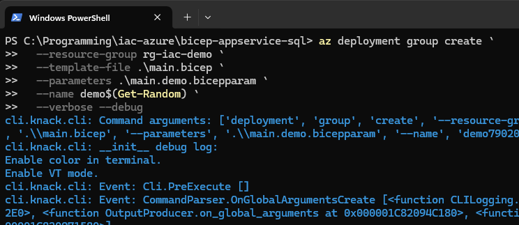
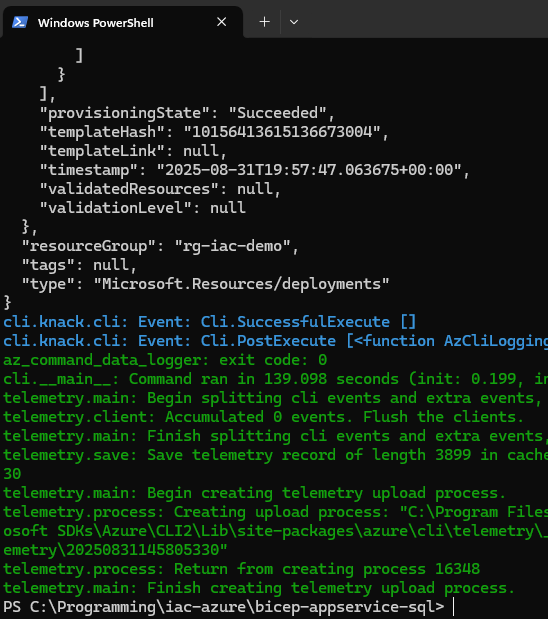
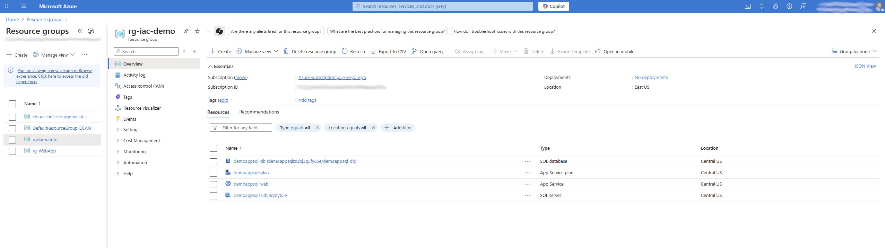

# IaC: App Service (Linux) + Azure SQL (opcional) con Bicep

Este demo despliega:

- **App Service Plan (Linux)**  
- **Web App (Linux)** con `httpsOnly` y `linuxFxVersion` configurable  
- **Azure SQL Server + Database** (opcional) con 3 modos de precio (Basic, Serverless, GP Provisioned)  
- Cadena de conexión como **App Setting** (`ConnectionStrings__Default`)  
- Portabilidad multi-nube mediante `environment().suffixes.sqlServerHostname` (evita URLs hardcodeadas)

> ⚠️ Requisitos de cuota: Algunas suscripciones tienen **0 vCPUs** en ciertas regiones. Si ves `SubscriptionIsOverQuotaForSku`, cambia la **región** o solicita aumento de **quota**.

---

## Arquitectura (alto nivel)

```
Resource Group
├─ Microsoft.Web/serverfarms  (App Service Plan - Linux)
├─ Microsoft.Web/sites        (Web App - Linux)
└─ Microsoft.Sql/servers      (opcional)
   ├─ firewallRules           (opcional)
   └─ databases               (opcional, Basic / Serverless / GP)
```

---

## Prerrequisitos

- **Azure CLI** 2.75+ (recomendado 2.76+)
- **Bicep CLI** (usa `az bicep upgrade`)
- Un **Resource Group** existente (o créalo)
- Permisos para desplegar `Microsoft.Web` y `Microsoft.Sql`

---

## Archivos

- `main.bicep` — plantilla principal
- `main.demo.bicepparam` — parámetros de ejemplo (modo **Basic/DTU**)
- (opcional) más `.bicepparam` para otras variantes

---

## Parámetros clave

| Parámetro | Descripción | Ejemplo/Default |
|---|---|---|
| `location` | Región de despliegue | `centralus` |
| `baseName` | Prefijo de nombres | `demoappsql` |
| `linuxFxVersion` | Runtime stack | `DOTNET|8.0`, `NODE|20-lts` |
| `appServiceSku*` | SKU/Tier/Size/Capacity | `F1` / `Free` / `F1` / `1` |
| `enableSql` | Habilita SQL | `true`/`false` |
| `sqlPricingMode` | `basic` / `serverless` / `gp_provisioned` | `basic` |
| `sqlHostSuffix` | Sufijo host SQL **(multi-nube)** | `environment().suffixes.sqlServerHostname` |
| `sqlAdminUser` / `sqlAdminPassword` | Admin SQL | `sqladminuser` / **secure** |
| `allowAzureIpsOnSql` | Regla 0.0.0.0 | `true` |
| `*Serverless / *GP` | Ajustes por modo | ver archivo |

> **Nota**: En `main.bicep` el `sqlHostSuffix` usa `environment().suffixes.sqlServerHostname` para evitar el warning `no-hardcoded-env-urls`. Puedes **sobrescribirlo** desde `.bicepparam` si lo necesitas.

---

## Despliegue rápido

### 1) Crear el Resource Group (si no existe)
```powershell
az group create -n rg-iac-demo -l eastus
```

### 2) (Opcional) Cambiar región si tienes 0 vCPUs
Edita `main.demo.bicepparam`:
```bicep
param location = 'centralus' // o 'southcentralus', 'westus2', 'brazilsouth'
```

### 3) Ejecutar el despliegue
```powershell
az bicep upgrade
az deployment group create `
  --resource-group rg-iac-demo `
  --template-file .\main.bicep `
  --parameters .\main.demo.bicepparam `
  --name demo$(Get-Random) `
  --verbose
```

### 4) Ver outputs
- **URL WebApp**: `webAppUrl`  
- **FQDN SQL** (si `enableSql=true`): `sqlServerFqdn`

---

## Validación sin aplicar cambios (What-If)

```powershell
az deployment group what-if `
  --resource-group rg-iac-demo `
  --template-file .\main.bicep `
  --parameters .\main.demo.bicepparam
```

---

## Variantes de SQL

- **Basic (DTU)**: barato para pruebas
  ```bicep
  param enableSql = true
  param sqlPricingMode = 'basic'
  ```
- **Serverless (GP serverless)**: consumo variable + autopause
  ```bicep
  param sqlPricingMode = 'serverless'
  param serverlessAutoPauseDelay = 60
  param serverlessMinVcores = 1
  param serverlessMaxSizeBytes = 34359738368
  ```
- **GP Provisioned**: rendimiento estable
  ```bicep
  param sqlPricingMode = 'gp_provisioned'
  param gpSkuName = 'GP_Gen5_2'
  param gpFamily  = 'Gen5'
  param gpCapacity = 2
  param gpMaxSizeBytes = 137438953472
  ```

> Cambia solo los parámetros; **no** necesitas modificar `main.bicep`.

---

## Cadena de conexión en Web App

Se inyecta como **App Setting**:
- `ConnectionStrings__Default`

Formato:
```
Server=tcp:<sqlServerName>.<sqlHostSuffix>,1433;Initial Catalog=<sqlDbName>;Persist Security Info=False;User ID=<sqlAdminUser>;Password=<sqlAdminPassword>;MultipleActiveResultSets=False;Encrypt=True;TrustServerCertificate=False;Connection Timeout=30;
```

> Si `enableSql=false`, no se agrega `ConnectionStrings__Default`.

---

## Problemas comunes (Troubleshooting)

- **SubscriptionIsOverQuotaForSku (0 VMs allowed, 1 requested)**  
  Cambia `param location` a otra región con cuota disponible **o** solicita aumento de vCPU/App Service en *Usage + quotas*.  
  Prueba rápido:
  ```powershell
  az appservice plan create -g rg-iac-demo -n quota-test-plan --sku F1 --is-linux -l eastus
  ```

- **Proveedor no registrado**
  ```powershell
  az provider show -n Microsoft.Sql --query registrationState -o tsv
  az provider register -n Microsoft.Sql
  ```

- **SKU no disponible en región**  
  Cambia a `F1/B1` u otra región.

- **Warning linter: no-hardcoded-env-urls**  
  Ya está resuelto con `environment().suffixes.sqlServerHostname`.  
  (Si usas soberano, puedes pasar un `sqlHostSuffix` alternativo vía `.bicepparam`).

- **Depuración detallada**  
  Añade `--debug` al comando de despliegue.

---

## Limpieza

```powershell
az group delete -n rg-iac-demo --yes --no-wait
```

---

## Buenas prácticas y seguridad

- No commitees contraseñas reales. Usa **Azure Key Vault** o variables seguras en pipelines.  
- Mantén `httpsOnly=true` (ya configurado).  
- Usa `what-if` antes de aplicar cambios a entornos no-demo.

---

## Siguientes pasos

- Añade **slots** de deployment y autoscale al Plan.  
- Integra **Key Vault** (secrets) y **Managed Identity**, quitando credenciales en cadena.  
- Parametriza reglas de firewall por IP/Range.  
- Crea `.bicepparam` para `serverless` y `gp_provisioned`.

---

## Ejemplo mínimo de `main.demo.bicepparam`

```bicep
using './main.bicep'

param location = 'eastus2'
param baseName = 'demoappsql'
param linuxFxVersion = 'DOTNET|8.0'

param appServiceSkuName = 'F1'
param appServiceSkuTier = 'Free'
param appServiceSkuSize = 'F1'
param appServiceCapacity = 1

param enableSql = true
param sqlPricingMode = 'basic'

// sqlHostSuffix por defecto viene de environment().suffixes.sqlServerHostname
// Puedes sobreescribirlo si necesitas:
// param sqlHostSuffix = 'database.windows.net'

param sqlAdminUser = 'sqladminuser'
@secure()
param sqlAdminPassword = 'Demo#Passw0rd123'  // Demo, no usar en prod

param allowAzureIpsOnSql = true
param basicMaxSizeBytes = 2147483648
```


# IaC: App Service (Linux) + Azure SQL (opcional) con Bicep

Este demo despliega:

* **App Service Plan (Linux)**
* **Web App (Linux)** con `httpsOnly` y `linuxFxVersion` configurable
* **Azure SQL Server + Database** (opcional) con 3 modos de precio (Basic, Serverless, GP Provisioned)
* Cadena de conexión como **App Setting** (`ConnectionStrings__Default`)
* Portabilidad multi-nube mediante `environment().suffixes.sqlServerHostname` (evita URLs hardcodeadas)

> ⚠️ Requisitos de cuota: Algunas suscripciones tienen **0 vCPUs** en ciertas regiones. Si ves `SubscriptionIsOverQuotaForSku`, cambia la **región** o solicita aumento de **quota**.

---

## Arquitectura (alto nivel)

```
Resource Group
├─ Microsoft.Web/serverfarms  (App Service Plan - Linux)
├─ Microsoft.Web/sites        (Web App - Linux)
└─ Microsoft.Sql/servers      (opcional)
   ├─ firewallRules           (opcional)
   └─ databases               (opcional, Basic / Serverless / GP)
```

---

## Prerrequisitos

* **Azure CLI** 2.75+ (recomendado 2.76+)
* **Bicep CLI** (usa `az bicep upgrade`)
* Un **Resource Group** existente (o créalo)
* Permisos para desplegar `Microsoft.Web` y `Microsoft.Sql`

---

## Archivos

* `main.bicep` — plantilla principal
* `main.demo.bicepparam` — parámetros de ejemplo (modo **Basic/DTU**)
* `.gitignore` — ignorar archivos locales, credenciales y binarios
* (opcional) más `.bicepparam` para otras variantes

---

## Parámetros clave

| Parámetro                           | Descripción                               | Ejemplo/Default                            |             |          |
| ----------------------------------- | ----------------------------------------- | ------------------------------------------ | ----------- | -------- |
| `location`                          | Región de despliegue                      | `eastus`                                   |             |          |
| `baseName`                          | Prefijo de nombres                        | `demoappsql`                               |             |          |
| `linuxFxVersion`                    | Runtime stack                             | \`DOTNET                                   | 8.0`, `NODE | 20-lts\` |
| `appServiceSku*`                    | SKU/Tier/Size/Capacity                    | `F1` / `Free` / `F1` / `1`                 |             |          |
| `enableSql`                         | Habilita SQL                              | `true`/`false`                             |             |          |
| `sqlPricingMode`                    | `basic` / `serverless` / `gp_provisioned` | `basic`                                    |             |          |
| `sqlHostSuffix`                     | Sufijo host SQL **(multi-nube)**          | `environment().suffixes.sqlServerHostname` |             |          |
| `sqlAdminUser` / `sqlAdminPassword` | Admin SQL                                 | `sqladminuser` / **secure**                |             |          |
| `allowAzureIpsOnSql`                | Regla 0.0.0.0                             | `true`                                     |             |          |
| `*Serverless / *GP`                 | Ajustes por modo                          | ver archivo                                |             |          |

> **Nota**: En `main.bicep` el `sqlHostSuffix` usa `environment().suffixes.sqlServerHostname` para evitar el warning `no-hardcoded-env-urls`. Puedes **sobrescribirlo** desde `.bicepparam` si lo necesitas.

---

## Despliegue rápido

### 1) Crear el Resource Group (si no existe)

```powershell
az group create -n rg-iac-demo -l eastus
```

### 2) (Opcional) Cambiar región si tienes 0 vCPUs

Edita `main.demo.bicepparam`:

```bicep
param location = 'eastus2' // o 'southcentralus', 'westus2', 'brazilsouth'
```

### 3) Ejecutar el despliegue

```powershell
az bicep upgrade
az deployment group create `
  --resource-group rg-iac-demo `
  --template-file .\main.bicep `
  --parameters .\main.demo.bicepparam `
  --name demo$(Get-Random) `
  --verbose
```

### 4) Ver outputs

* **URL WebApp**: `webAppUrl`
* **FQDN SQL** (si `enableSql=true`): `sqlServerFqdn`

---

## Validación sin aplicar cambios (What-If)

```powershell
az deployment group what-if `
  --resource-group rg-iac-demo `
  --template-file .\main.bicep `
  --parameters .\main.demo.bicepparam
```

---

## Variantes de SQL

* **Basic (DTU)**: barato para pruebas

  ```bicep
  param enableSql = true
  param sqlPricingMode = 'basic'
  ```
* **Serverless (GP serverless)**: consumo variable + autopause

  ```bicep
  param sqlPricingMode = 'serverless'
  param serverlessAutoPauseDelay = 60
  param serverlessMinVcores = 1
  param serverlessMaxSizeBytes = 34359738368
  ```
* **GP Provisioned**: rendimiento estable

  ```bicep
  param sqlPricingMode = 'gp_provisioned'
  param gpSkuName = 'GP_Gen5_2'
  param gpFamily  = 'Gen5'
  param gpCapacity = 2
  param gpMaxSizeBytes = 137438953472
  ```

> Cambia solo los parámetros; **no** necesitas modificar `main.bicep`.

---

## Cadena de conexión en Web App

Se inyecta como **App Setting**:

* `ConnectionStrings__Default`

Formato:

```
Server=tcp:<sqlServerName>.<sqlHostSuffix>,1433;Initial Catalog=<sqlDbName>;Persist Security Info=False;User ID=<sqlAdminUser>;Password=<sqlAdminPassword>;MultipleActiveResultSets=False;Encrypt=True;TrustServerCertificate=False;Connection Timeout=30;
```

> Si `enableSql=false`, no se agrega `ConnectionStrings__Default`.

---

## Problemas comunes (Troubleshooting)

* **SubscriptionIsOverQuotaForSku (0 VMs allowed, 1 requested)**
  Cambia `param location` a otra región con cuota disponible **o** solicita aumento de vCPU/App Service en *Usage + quotas*.
  Prueba rápido:

  ```powershell
  az appservice plan create -g rg-iac-demo -n quota-test-plan --sku F1 --is-linux -l eastus
  ```

* **Proveedor no registrado**

  ```powershell
  az provider show -n Microsoft.Sql --query registrationState -o tsv
  az provider register -n Microsoft.Sql
  ```

* **SKU no disponible en región**
  Cambia a `F1/B1` u otra región.

* **Warning linter: no-hardcoded-env-urls**
  Ya está resuelto con `environment().suffixes.sqlServerHostname`.
  (Si usas soberano, puedes pasar un `sqlHostSuffix` alternativo vía `.bicepparam`).

* **Depuración detallada**
  Añade `--debug` al comando de despliegue.

---

## Limpieza

```powershell
az group delete -n rg-iac-demo --yes --no-wait
```

---

## Buenas prácticas y seguridad

* No commitees contraseñas reales. Usa **Azure Key Vault** o variables seguras en pipelines.
* Mantén `httpsOnly=true` (ya configurado).
* Usa `what-if` antes de aplicar cambios a entornos no-demo.

---

## Siguientes pasos

* Añade **slots** de deployment y autoscale al Plan.
* Integra **Key Vault** (secrets) y **Managed Identity**, quitando credenciales en cadena.
* Parametriza reglas de firewall por IP/Range.
* Crea `.bicepparam` para `serverless` y `gp_provisioned`.

---

## Ejemplo mínimo de `main.demo.bicepparam`

```bicep
using './main.bicep'

param location = 'eastus2'
param baseName = 'demoappsql'
param linuxFxVersion = 'DOTNET|8.0'

param appServiceSkuName = 'F1'
param appServiceSkuTier = 'Free'
param appServiceSkuSize = 'F1'
param appServiceCapacity = 1

param enableSql = true
param sqlPricingMode = 'basic'

// sqlHostSuffix por defecto viene de environment().suffixes.sqlServerHostname
// Puedes sobreescribirlo si necesitas:
// param sqlHostSuffix = 'database.windows.net'

param sqlAdminUser = 'sqladminuser'
@secure()
param sqlAdminPassword = 'Demo#Passw0rd123'  // Demo, no usar en prod

param allowAzureIpsOnSql = true
param basicMaxSizeBytes = 2147483648
```

---

## CHANGELOG

### v1.0.0 (Demo inicial)

* Plantilla **App Service (Linux)** + **Azure SQL opcional**.
* Soporte para tres modos de SQL: `basic`, `serverless`, `gp_provisioned`.
* Inclusión de cadena de conexión en App Settings.
* Corrección de linter: `sqlHostSuffix` parametrizado con `environment().suffixes.sqlServerHostname`.
* Ejemplo `.bicepparam` incluido.

## Visualizacion del despliegue

1) Coinsole In:



2) Console out:



3) POV Azure GUI deployed resources


